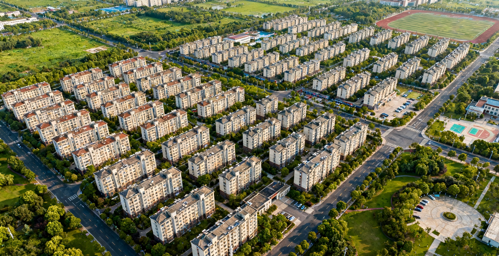

# 1. Overview

## 1.1 Background

Housing represents a fundamental component of household wealth and a major financial commitment for most individuals worldwide. In Singapore, where over 80% of the population resides in public housing, Housing & Development Board (HDB) resale prices are of particular socioeconomic significance. Traditional housing price models, typically estimated using Ordinary Least Squares (OLS) regression, often fail to account for the spatial dependencies inherent in real estate data. As noted by Anselin (1998), when spatial autocorrelation and spatial heterogeneity exist—common characteristics in geographical datasets—OLS estimations may yield biased, inconsistent, or inefficient results. This limitation is especially relevant in Singapore's context, where locational advantages (e.g., proximity to MRT stations, CBD, and amenities) exhibit complex spatial patterns that conventional global models cannot adequately capture.

## 1.2 Objectives

The primary objective of this exercise is to develop a spatially informed explanatory model identifying factors affecting 4-room HDB resale prices in Singapore during January to September 2025. Specifically, this study aims to:

1.  Employ geospatial data wrangling techniques to transform aspatial HDB transaction data into geographically referenced information

2.  Derive relevant structural and locational predictors using open-source geographical data

3.  Calibrate both global (OLS) and local (GWR) regression models to compare their performance

4.  Evaluate the presence and impact of spatial heterogeneity on housing price determinants

5.  Provide nuanced insights into how various factors differentially influence resale prices across geographical locations

# 2. Data Wrangling

## 2.1 Loading Packages

| Package | Function |
|----|----|
| httr | R package for HTTP requests to interact with web APIs |
| tidyverse | Collection of R packages for data science including dplyr, ggplot2, etc. |
| sf | Simple Features for R, handling spatial vector data |
| tmap | Thematic map package for creating static and interactive maps |
| jsonlite | R package for parsing and generating JSON data |
| progress | Progress bar package for long-running tasks |
| rsample | Resampling methods for model assessment and validation |
| GWmodel | Geographically weighted models for spatial heterogeneity modeling |

```{r}
pacman::p_load(httr, tidyverse, sf, tmap, jsonlite, progress, rsample, GWmodel)
```

## 2.2 The Data

Raw data: **HDB Resale Flat Prices** are from *data.gov.sg* and published by the *Singapore Housing & Development Board*. The dataset contains all HDB resale prices from 2017 to the present, totaling 219,071 records. This report uses only data from January 2025 to September 2025.

## 2.3 Importing HDB data

```{r,eval=FALSE}
HDBresale_raw <- read_csv("data/rawdata/HDBresale.csv")
```

```{r,eval=FALSE}
HDBresale <- HDBresale_raw %>%
  filter(flat_type == "4 ROOM") %>%
  filter(month >= "2025-01" & month < "2025-10")

head(HDBresale)
```

## 2.4 Geocoding

### 2.4.1 Preprocess street name

```{r,eval=FALSE}
HDBresale <- HDBresale %>%
  mutate(street_name = gsub("ST\\.", "SAINT", street_name))
```

### 2.4.2 Define the geocode function

```{r,eval=FALSE}
geocode <- function(block, streetname) {
  base_url <- "https://onemap.gov.sg/api/common/elastic/search"
  address <- paste(block, streetname, sep = "")
  query <- list(
    "searchVal" = address,
    "returnGeom" = "Y",
    "getAddrDetails" = "N",
    "pageNum" = "1"
  )
  
  res <- GET(base_url, query = query)
  restext <- content(res, as = "text")
  json <- fromJSON(restext)
  
  if(length(json$results) == 0){
    return(data.frame(LATITUDE = NA, LONGITUDE = NA))
  }
  
  output <- as.data.frame(json$results) %>%
    select(LATITUDE, LONGITUDE)
  
  return(output[1, ])
}
```

### 2.4.3 Data geocoding

```{r,eval=FALSE}
HDBresale$LATITUDE <- NA
HDBresale$LONGITUDE <- NA

for(i in 1:nrow(HDBresale)){
  temp_output <- tryCatch({
    geocode(HDBresale[i,"block"], HDBresale[i,"street_name"])
  }, error = function(e){
    data.frame(LATITUDE = NA, LONGITUDE = NA)
  })
  
  HDBresale$LATITUDE[i] <- temp_output$LATITUDE
  HDBresale$LONGITUDE[i] <- temp_output$LONGITUDE
}
```

```{r,eval=FALSE}
write_rds(HDBresale, "data/rds/HDB.rds")
```

```{r}
HDB <- readRDS("data/rds/HDB.rds")
```

The code above calls the OneMap API to obtain latitude and longitude data. Because this process is time-consuming, it is only run once, and the generated rds file is saved for later use.

### 2.4.4 Convert SF data

```{r}
HDBresale_sf <- HDB %>%
  st_as_sf(
    coords = c("LONGITUDE", "LATITUDE"),
    crs = 4326) %>%
  st_transform(crs = 3414)
```

## 2.5 Load other geospatial data

This report also used the following data:

1.  Zoning boundary data from Singapore's 2019 Master Plan, used as the base map for mapping.

2.  Geospatial data for all preschools in Singapore.

3.  Geospatial data for all MRT/LRT station exits in Singapore.

```{r}
mpsz <- st_read("data/rawdata/MasterPlan2019SubzoneBoundaryNoSeaKML.kml") %>% 
  st_zm(drop = TRUE, what = "ZM") %>% st_transform(crs = 3414)

preschool = st_read("data/rawdata/PreschoolsLocation.kml") %>%
  st_transform(crs = 3414)

mrt <- st_read("data/rawdata/LTAMRTStationExitKML.kml") %>% 
  st_transform(crs = 3414)
```

## 2.6 Distance calculation

Calculate the distance from each HDB unit to the nearest MRT station.

```{r}
nearest_mrt <- st_nearest_feature(HDBresale_sf, mrt)
HDBresale_sf$PROX_MRT <- st_distance(HDBresale_sf, mrt[nearest_mrt, ], by_element = TRUE)
HDBresale_sf$PROX_MRT <- as.numeric(HDBresale_sf$PROX_MRT) / 1000

# Calculate the number of preschools within 350 meters of each HDB unit.
within_350m_preschool <- st_is_within_distance(HDBresale_sf, preschool, dist = 350)
HDBresale_sf$WITHIN_350M_KINDERGARTEN <- map_int(within_350m_preschool, length)

head(HDBresale_sf %>% select(PROX_MRT, WITHIN_350M_KINDERGARTEN))
```

# 3. Exploratory analysis

## 3.1 Spatial distribution of HDB resale prices

```{r}
tmap_mode("plot")

tm_shape(mpsz) +
  tm_polygons(alpha = 0.1, 
              border.col = "grey") +
tm_shape(HDBresale_sf) +
  tm_dots(col = "resale_price",
          palette = "viridis",
          style = "quantile",
          n = 5,
          size = 0.2,
          alpha = 0.8,
          title = "HDB Resale Price (SGD)") +
  tm_layout(title = "Spatial Distribution of 4-Room HDB Resale Prices (2025)",
            frame = FALSE) 
```

Generally, **HDB resale prices are significantly higher in and around the city center** (mostly green and yellow) and relatively lower in areas far from the city center (mostly purple and dark blue), reflecting a distinct spatial variation in resale prices, which is closely related to location factors.

## 3.2 Spatial pattern visualizing distance to MRT

```{r}
tm_shape(mpsz) +
  tm_polygons(alpha = 0.1,
              border.col = "grey") +
tm_shape(HDBresale_sf) +
  tm_dots(col = "PROX_MRT",
          palette = "-plasma",
          style = "quantile",
          n = 5,
          size = 0.2,
          alpha = 0.8,
          title = "Distance to Nearest MRT (km)") +
tm_shape(mrt) + 
  tm_dots(col = "red",
          size = 0.2,
          alpha = 0.8,
          title = "MRT Station") +
  tm_layout(title = "Spatial Distribution: Distance to MRT Stations",
            frame = FALSE)
```

**Areas in and around the city center are mostly close to MRT stations** (predominantly yellow, orange, and red), while **some areas far from the core are relatively far from MRT stations** (predominantly light purple and dark purple), reflecting the spatial distribution pattern around MRT stations in Singapore, which can also provide a reference for understanding the location value of HDB flats, etc.

## 3.3 Spatial pattern of preschool density visualization

```{r}
tm_shape(mpsz) +
  tm_polygons(alpha = 0.1,
              border.col = "grey") +
tm_shape(HDBresale_sf) +
  tm_dots(col = "WITHIN_350M_KINDERGARTEN",
          palette = "Blues",
          style = "fixed",
          breaks = c(0, 3, 6, 9, 12, 15),
          size = 0.2,
          alpha = 0.8,
          title = "Number of Preschools within 350m") +
tm_shape(preschool) + 
  tm_dots(col = "purple",
          size = 0.2,
          alpha = 0.6,
          title = "Preschool") +
  tm_layout(title = "Spatial Distribution: Preschool Density",
            frame = FALSE)
```

**The city center and densely populated residential areas have a higher density of kindergartens** (more dark-colored points), with more kindergartens accessible within a 350-meter radius. In contrast, some peripheral areas have relatively lower kindergarten density (more light-colored points). 

# 4. Modeling

## 4.1 Building a modeling dataset

### 4.1.1 Structural Factors

```{r}
HDBresale_sf <- HDBresale_sf %>%
  mutate(
    
    remaining_lease_mths = ifelse(
      "remaining_lease" %in% names(.),
      as.numeric(remaining_lease) * 12,  
      (99 - (2025 - as.numeric(substr(lease_commence_date, 1, 4)))) * 12  
    ),
    
    storey_order = case_when(
      storey_range == "01 TO 03" ~ 1,
      storey_range == "04 TO 06" ~ 2,
      storey_range == "07 TO 09" ~ 3,
      storey_range == "10 TO 12" ~ 4,
      storey_range == "13 TO 15" ~ 5,
      storey_range == "16 TO 18" ~ 6,
      storey_range == "19 TO 21" ~ 7,
      storey_range == "22 TO 24" ~ 8,
      storey_range == "25 TO 27" ~ 9,
      storey_range == "28 TO 30" ~ 10,
      storey_range == "31 TO 33" ~ 11,
      storey_range == "34 TO 36" ~ 12,
      storey_range == "37 TO 39" ~ 13,
      storey_range == "40 TO 42" ~ 14,
      TRUE ~ 7  
    )
  )
```

### 4.1.2 Location Factors

Calculate the distance to the CBD (assuming the CBD is near Raffles Place)

```{r}
cbd_point <- data.frame(lon = 103.851959, lat = 1.284053) %>%
  st_as_sf(coords = c("lon", "lat"), crs = 4326) %>%
  st_transform(crs = 3414)

HDBresale_sf$PROX_CBD <- st_distance(HDBresale_sf, cbd_point) %>% 
  as.numeric() / 1000  
```

```{r}
within_1km_pri <- st_is_within_distance(HDBresale_sf, preschool, dist = 1000)
HDBresale_sf$WITHIN_1KM_PRISCH <- map_int(within_1km_pri, length)
```

## 4.1.3 Data quality check

```{r}
# Check for missing values
cat("=== Data integrity check ===\n")
cat("Total number of records:", nrow(HDBresale_sf), "\n\n")
cat("Missing value statistics:\n")
missing_summary <- sapply(HDBresale_sf %>% st_drop_geometry(), function(x) sum(is.na(x)))
print(missing_summary[missing_summary > 0])  

# Examine summary statistics of key variables
cat("\n=== Summary statistics of key variables ===\n")
HDBresale_sf %>% 
  st_drop_geometry() %>%
  select(resale_price, floor_area_sqm, remaining_lease_mths, storey_order, 
         PROX_MRT, PROX_CBD, WITHIN_350M_KINDERGARTEN, WITHIN_1KM_PRISCH) %>%
  summary()
```

The data has no missing values, making it suitable for modeling. However, we noticed that the remaining lease term value was not identified, so further processing is needed.

```{r}
# Convert "XX years YY months" to month values.
HDBresale_sf <- HDBresale_sf %>%
  mutate(
    # Extract year numbers
    lease_years = as.numeric(str_extract(remaining_lease, "\\d+(?=\\s*years)")),
    # Extract month numbers
    lease_months = as.numeric(str_extract(remaining_lease, "\\d+(?=\\s*months)")) %>% replace_na(0),
    # Calculate the total number of months
    remaining_lease_mths = lease_years * 12 + lease_months
  ) %>%
  # Remove temporary variables
  select(-lease_years, -lease_months)

# Verify conversion results
cat("\nTransformed remaining_lease_mths summary:\n")
summary(HDBresale_sf$remaining_lease_mths)

# Recheck missing values
cat("\n=== Final missing value check ===\n")
sapply(HDBresale_sf %>% st_drop_geometry(), function(x) sum(is.na(x)))
```

## 4.2 Data sampling and segmentation

```{r}
set.seed(1234)

if(nrow(HDBresale_sf) > 1500) {
  HDB_sample <- HDBresale_sf %>%
    sample_n(1500)
} else {
  HDB_sample <- HDBresale_sf
}

cat("Data volume after sampling:", nrow(HDB_sample), "records\n")

# Check for overlapping points in the sampled data.
overlapping_points <- HDB_sample %>%
  mutate(overlap = lengths(st_equals(., .)) > 1)
cat("Number of overlapping points:", sum(overlapping_points$overlap), "\n")

# Split the training set and the test set
set.seed(1234)
resale_split <- initial_split(HDB_sample, prop = 0.67)
train_data <- training(resale_split)
test_data <- testing(resale_split)

cat("Training set data volume:", nrow(train_data), "records\n")
cat("Test set data size:", nrow(test_data), "records\n")
```

## 4.2.1 Handling overlapping points

```{r}
# Add random offsets to overlapping points
set.seed(1234)
train_data <- train_data %>%
  group_by(geometry) %>%
  mutate(
    n_duplicates = n(),

    geometry = ifelse(n_duplicates > 1,
                     geometry + runif(2, -1, 1),
                     geometry)
  ) %>%
  ungroup() %>%
  st_sf()

cat("After handling overlapping points, the number of unique locations in the training set:", nrow(unique(train_data)), "\n")
```

## 4.3 OLS model

```{r}
# Calibrate OLS model
price_mlr <- lm(resale_price ~ floor_area_sqm +
                  storey_order + remaining_lease_mths +
                  PROX_CBD + PROX_MRT + 
                  WITHIN_350M_KINDERGARTEN + WITHIN_1KM_PRISCH,
                data = train_data)

# Display OLS results
cat("=== OLS model results ===\n")
summary(price_mlr)

# Check the model fit
cat("\n=== Model fit ===\n")
cat("R-squared:", summary(price_mlr)$r.squared, "\n")
cat("Adjusted R-squared:", summary(price_mlr)$adj.r.squared, "\n")
```

## 4.4 GWR model

### 4.4.1 Calibrate GWR model

```{r}
# Convert the sf object to a SpatialPointsDataFrame
train_data_sp <- as(train_data, "Spatial")

# Calculate the optimal bandwidth for GWR
cat("Start calculating GWR bandwidth\n")
bw_adaptive <- bw.gwr(
  resale_price ~ floor_area_sqm +
    storey_order + remaining_lease_mths +
    PROX_CBD + PROX_MRT + 
    WITHIN_1KM_PRISCH,  
  data = train_data_sp,
  approach = "CV",
  kernel = "gaussian",
  adaptive = TRUE,
  longlat = FALSE
)

cat("Optimal bandwidth (number of neighboring points):", bw_adaptive, "\n")

# Save bandwidth results
write_rds(bw_adaptive, "data/bw_adaptive.rds")
```

### 4.4.2 Running the GWR model

```{r}
gwr_adaptive <- gwr.basic(
  resale_price ~ floor_area_sqm +
    storey_order + remaining_lease_mths +
    PROX_CBD + PROX_MRT + 
    WITHIN_1KM_PRISCH,
  data = train_data_sp,
  bw = bw_adaptive,
  kernel = "gaussian",
  adaptive = TRUE,
  longlat = FALSE
)

cat("=== GWR model results ===\n")
print(gwr_adaptive)
```

```{r}
# Comparing the performance of OLS and GWR
cat("\n=== Model Comparison ===\n")
cat("OLS R-squared:", round(summary(price_mlr)$r.squared, 4), "\n")
cat("GWR R-squared:", round(gwr_adaptive$GW.diagnostic$gw.R2, 4), "\n")
cat("GWR Adjusted R-squared:", round(gwr_adaptive$GW.diagnostic$gwR2.adj, 4), "\n")
cat("GWR RSS:", round(gwr_adaptive$GW.diagnostic$RSS, 2), "\n")
cat("OLS RSS:", round(sum(price_mlr$residuals^2), 2), "\n")
```

```{r}
# Add the GWR results back to the training data.
train_data_with_gwr <- train_data %>%
  mutate(
    gwr_residuals = gwr_adaptive$SDF$residual,
    gwr_fitted = gwr_adaptive$SDF$yhat
  )

# Save GWR model results
write_rds(gwr_adaptive, "data/gwr_model.rds")
cat("The nGWR model has been saved to: data/gwr_model.rds\n")
```

## 4.5 Visualization of modeling results

```{r}
# Add the GWR coefficient to the spatial data.
gwr_results <- st_as_sf(gwr_adaptive$SDF) %>%
  st_set_crs(3414)

# Visualize the coefficients of key variables.
coefficients_to_plot <- c("floor_area_sqm", "storey_order", "PROX_CBD", "PROX_MRT")
```

```{r}
## Spatial distribution map of GWR coefficient
tmap_mode("plot")

for(coef in coefficients_to_plot) {
  map_title <- paste("GWR Coefficient:", coef)
  
  p <- tm_shape(mpsz) +
    tm_polygons(alpha = 0.1, border.col = "grey") +
    tm_shape(gwr_results) +
    tm_dots(col = coef,
            palette = "RdYlBu",
            style = "pretty",
            size = 0.2,
            title = paste("Coefficient:", coef),
            midpoint = 0) + 
    tm_layout(title = map_title,
              frame = FALSE)
  
  print(p)
}
```

## 4.6 Residual comparison

### 4.6.1 GWR residual space distribution

```{r}
train_data_with_gwr <- train_data %>%
  mutate(
    gwr_residuals = gwr_adaptive$SDF$residual,
    gwr_fitted = gwr_adaptive$SDF$yhat,
    ols_residuals = price_mlr$residuals
  )
```

```{r}
tm_shape(mpsz) +
  tm_polygons(alpha = 0.1, border.col = "grey") +
  tm_shape(train_data_with_gwr) +
  tm_dots(col = "gwr_residuals",
          palette = "RdYlBu",
          style = "pretty",
          size = 0.5,
          title = "GWR Residuals (SGD)",
          midpoint = 0) +
  tm_layout(title = "Spatial Distribution of GWR Residuals",
            frame = FALSE)
```

```{r}
# Save the final analysis dataset
write_rds(train_data_with_gwr, "data/final_analysis_data.rds")

# Final Model Summary
cat("\n=== Final Model Performance Summary ===\n")
cat("OLS R-squared:", round(summary(price_mlr)$r.squared, 4), "\n")
cat("GWR R-squared:", round(gwr_adaptive$GW.diagnostic$gw.R2, 4), "\n")
cat("Performance improvement:", round((gwr_adaptive$GW.diagnostic$gw.R2 - summary(price_mlr)$r.squared) * 100, 1), "%\n")
cat("Number of valid parameters for GWR:", round(gwr_adaptive$GW.diagnostic$enp, 1), "\n")
```

# 5. Conclusion

This study successfully demonstrates the critical importance of accounting for spatial heterogeneity in HDB resale price modelling. The comparison between Ordinary Least Squares (OLS) and Geographically Weighted Regression (GWR) reveals substantial improvements in model performance, with explanatory power increasing from 78.6% (OLS) to 93.7% (GWR). More significantly, the GWR model uncovers the spatially varying relationships between housing prices and their determinants—relationships that the global OLS model inherently masks.

The findings confirm that factors such as proximity to MRT stations, distance from the CBD, and structural attributes do not exert uniform effects across Singapore. Instead, their influences are highly localized, contingent upon specific regional contexts. This nuanced understanding provides valuable insights for various stakeholders: homeowners and buyers can make more informed location-specific decisions, urban planners can develop targeted regional policies, and real estate professionals can conduct more accurate, geographically sensitive valuations.

Ultimately, this exercise validates that geospatial analytics, particularly GWR, offers a superior methodological framework for understanding Singapore's complex public housing market. Future research could incorporate additional temporal dimensions or more granular neighborhood characteristics to further enhance the model's explanatory depth.
